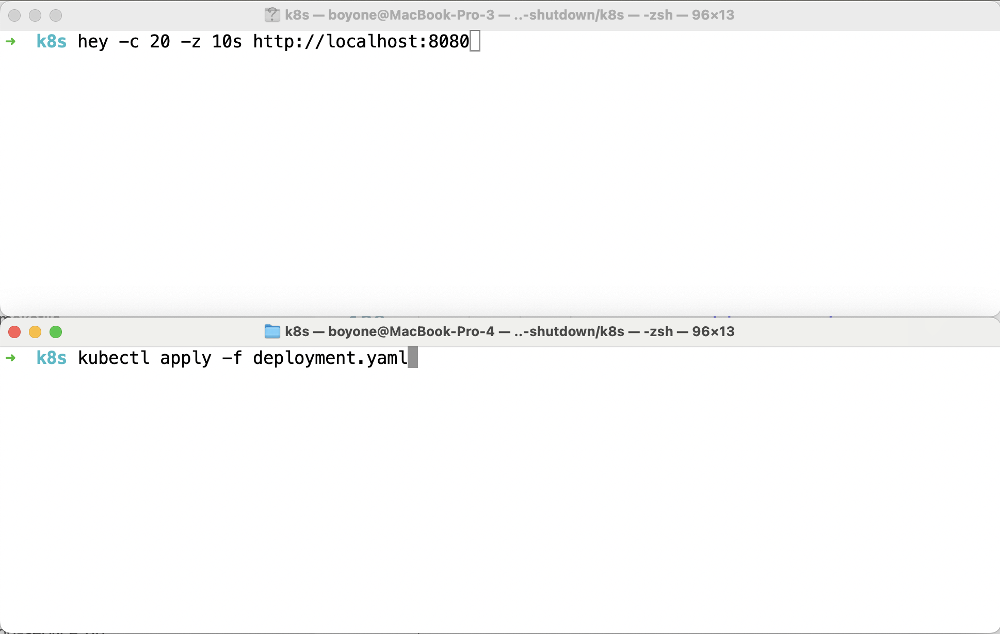

# Graceful Shutdown

## Prerequisite

1. [k3d](https://k3d.io/v5.6.3/)
2. [hey](https://github.com/rakyll/hey)
3. [docker](https://www.docker.com/)

## Getting Start

1. Build image

   ```sh
   cd greeting-service
   ./gradlew bootBuildImage
   docker image ls
   ```

### Hello Kubernetes with `k3d`

1. Create Cluster

   ```sh
   k3d cluster create default -p "8080:8080@loadbalancer" --servers 1 --agents 3
   k3d image import greeting-service:0.0.1-SNAPSHOT --cluster default
   kubectl get nodes
   ```

   - Delete Cluster `k3d cluster delete default`

2. Create and Change Working Directory

   - Create directory call `k8s`
   - Change directory to `k8s`

     ```sh
     cd k8s
     ```

3. Create Deployment call deployment.yaml

   ```yaml
   apiVersion: apps/v1
   kind: Deployment
   metadata:
     labels:
       app: greeting-service
     name: greeting-service
   spec:
     replicas: 2
     selector:
       matchLabels:
         app: greeting-service
     template:
       metadata:
         labels:
           app: greeting-service
       spec:
         containers:
           - image: greeting-service:0.0.1-SNAPSHOT
             imagePullPolicy: IfNotPresent
             name: greeting-service
   ```

4. Create Service service.yaml

   ```yaml
   apiVersion: v1
   kind: Service
   metadata:
     labels:
       app: greeting-service
     name: greeting-service
   spec:
     ports:
       - port: 8080
         protocol: TCP
         targetPort: 8080
     selector:
       app: greeting-service
     type: LoadBalancer
   ```

5. Create Deployment with `apply`

   ```sh
   kubectl apply -f deployment.yaml
   kubectl get deployments
   kubectl get pods
   ```

6. Create Service with `apply`

   ```sh
   kubectl apply -f service.yaml
   kubectl get service
   ```

7. Test with curl

   ```sh
   curl http://localhost:8080/
   ```

8. Test with `hey`

   ```sh
   hey -c 20 -z 10s http://localhost:8080
   ```

---

## Test Scaling

1. Change `replecas` from 2 to 3 at `deployment.yaml`

   ```yaml
   apiVersion: apps/v1
   kind: Deployment
   metadata:
     labels:
       app: greeting-service
     name: greeting-service
   spec:
     replicas: 3 # change from 2 to 3
     selector:
       matchLabels:
         app: greeting-service
     template:
       metadata:
         labels:
           app: greeting-service
       spec:
         containers:
           - image: greeting-service:0.0.1-SNAPSHOT
             imagePullPolicy: IfNotPresent
             name: greeting-service
   ```

2. Proof Scaling

   

   1. Open new terminal and type following command[`test terminal`]

      ```sh
      hey -c 20 -z 10s http://localhost:8080
      ```

   2. Switch to previous terminal then type following command[`apply terminal`]

      ```sh
      kubectl apply -f deployment.yaml
      ```

   3. Press `enter` on `test terminal` and switch to `apply terminal` immediately then press `enter`

3. Waiting for result

   ```sh
   Error distribution:
   [XXXXX]	Get "http://localhost:8080": EOF
   ```

4. What happens during scaling?

---

## Add Graceful Shutdown

1. Change greeting message

   ```java
   @GetMapping("/")
   public String getGreeting() {
       return "Hello, Graceful Shutdown!";
   }
   ```

2. Change artifact version at `build.gradle` from `'0.0.1-SNAPSHOT'` to version `'0.0.2-SNAPSHOT'`

   ```gradle
   version = '0.0.2-SNAPSHOT'
   ```

3. add <project>/src/main/resources/application.yaml

   ```yaml
   server:
     port: 8080
   shutdown: graceful # switch to a graceful mode
   tomcat:
     connection-timeout: 2s # default 20s
     keep-alive-timeout: 15s
     threads:
       max: 50
       min-spare: 5

   spring:
     application:
       name: catalog-service
     lifecycle:
       timeout-per-shutdown-phase: 15s # default is 30s
   ```

   - The `server.tomcat.connection-timeout` property defines a limit for how much time Tomcat should wait between accepting a TCP connection from a client and actually receiving the HTTP request.
   - The `server.tomcat.keep-alive-timeout` property defines how long to keep a connection open while waiting for new HTTP requests.
   - The `server.shutdown` property defines shutdown mode. By default, Spring Boot stops the server immediately after receiving a termination signal (`SIGTERM`). You can switch to a graceful mode by configuring the `server.shutdown` property.
   - The `spring.lifecycle.timeout-per-shutdown-phase` properties defines a grace period. By default the grace period is 30 seconds.

4. Build docker image

   - Change directory to `greeting-service`

   ```sh
   ./gradlew bootBuildImage
   docker image ls
   ```

5. Load image to cluster

   ```sh
   k3d image import greeting-service:0.0.2-SNAPSHOT --cluster default
   ```

6. Change image from `greeting-service:0.0.1-SNAPSHOT` to `greeting-service:0.0.2-SNAPSHOT` at `deployment.yaml` file

   ```yaml
   spec:
     containers:
       - image: greeting-service:0.0.2-SNAPSHOT
         imagePullPolicy: IfNotPresent
         name: greeting-service
   ```

7. Proof Graceful Shutdown

   

   1. Open new terminal and type following command[`test terminal`]

      ```sh
      hey -c 20 -z 10s http://localhost:8080
      ```

   2. Switch to previous terminal then type following command[`apply terminal`]

      - `k8s` directory

      ```sh
      kubectl apply -f deployment.yaml
      ```

   3. Press `enter` on `test terminal` and switch to `apply terminal` immediately then press `enter`

8. What happens?

---

## Add Health Check

1. Change greeting message

   ```java
   @GetMapping("/")
   public String getGreeting() {
       return "Hello, Graceful Shutdown and Health Check!";
   }
   ```

2. Change artifact version at `build.gradle` from `'0.0.1-SNAPSHOT'` to version `'0.0.2-SNAPSHOT'`

   ```gradle
   version = '0.0.3-SNAPSHOT'
   ```

3. Add `implementation 'org.springframework.boot:spring-boot-starter-actuator'` to `build.gradle`

   ```gradle
   dependencies {
    implementation 'org.springframework.boot:spring-boot-starter-web'
    implementation 'org.springframework.boot:spring-boot-starter-actuator'
    testImplementation 'org.springframework.boot:spring-boot-starter-test'
    testRuntimeOnly 'org.junit.platform:junit-platform-launcher'
   }
   ```

4. Set exposing the health Actuator endpoint at application.yaml

   ```yaml
   server:
     port: 8080
     shutdown: graceful
     tomcat:
       connection-timeout: 2s
       keep-alive-timeout: 15s
       threads:
         max: 50
         min-spare: 5

   spring:
     application:
       name: catalog-service
     lifecycle:
       timeout-per-shutdown-phase: 15s

   management:
     endpoints:
       web:
       exposure:
         include: health
     endpoint:
       health:
         show-details: always
         show-components: always
         probes:
           enabled: true
   ```

5. Build docker image

   - Change directory to `greeting-service`

   ```sh
   ./gradlew bootBuildImage
   docker image ls
   ```

6. Load image to cluster

   ```sh
   k3d image import greeting-service:0.0.3-SNAPSHOT --cluster default
   ```

7. Change image from `greeting-service:0.0.2-SNAPSHOT` to `greeting-service:0.0.3-SNAPSHOT` at `deployment.yaml` file

   ```yaml
   spec:
     containers:
       - image: greeting-service:0.0.3-SNAPSHOT
         imagePullPolicy: IfNotPresent
         name: greeting-service
         livenessProbe:
           httpGet:
             path: /actuator/health/liveness
             port: 8080
           initialDelaySeconds: 10
           periodSeconds: 5
         readinessProbe:
           httpGet:
             path: /actuator/health/readiness
             port: 8080
           initialDelaySeconds: 5
           periodSeconds: 15
   ```

8. Proof Health Check

   

   1. Open new terminal and type following command[`test terminal`]

      ```sh
      hey -c 20 -z 10s http://localhost:8080
      ```

   2. Switch to previous terminal then type following command[`apply terminal`]

      - `k8s` directory

      ```sh
      kubectl apply -f deployment.yaml
      ```

   3. Press `enter` on `test terminal` and switch to `apply terminal` immediately then press `enter`

9. What happens?

10. Check Application's health

    ```sh
    curl http://localhost:8080/actuator/health
    curl http://localhost:8080/actuator/health/liveness
    curl http://localhost:8080/actuator/health/readiness
    ```

11. What is liveness and readiness?

|                                                   | Liveness                                                      | Readiness                                                                               |
| :------------------------------------------------ | :------------------------------------------------------------ | :-------------------------------------------------------------------------------------- |
| Semantic meaning                                  | Is the container running?                                     | Is the container ready to receive traffic?                                              |
| Implication of probe failures exceeding threshold | Pod is terminated and replaced.                               | Pod is removed from receiving traffic until the probe passes.                           |
| Time to recover from a failed probe               | Slow: Pod is rescheduled on fail- ure and needs time to boot. | Fast: Pod is already running and can immediately receive traffic once the probe passes. |
| Default state at container boot                   | Passing (live).                                               | Failing (unready).                                                                      |

- from `Wiliam Denniss, Kubernetes for Developers(Manning Publications Co.), p. 80.`

---

## Tip set `preStop` at container's lifecycle

```yaml
spec:
  containers:
    - image: greeting-service:0.0.4-SNAPSHOT
      imagePullPolicy: IfNotPresent
      name: greeting-service
      lifecycle:
        preStop:
          exec:
            command: ['sh', '-c', 'sleep 5']
```
